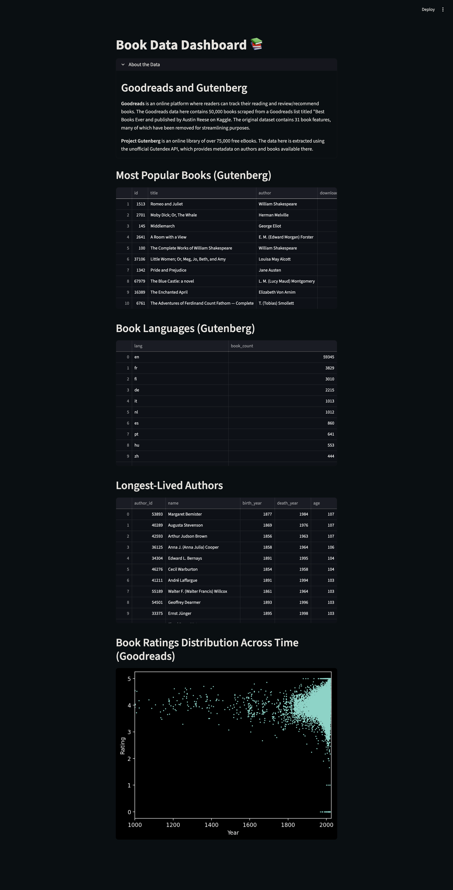

# book-data-pipeline

## :books: Book Data Pipeline and Dashboard

### Overview

This project builds an ETL pipeline integrating Goodreads and Project Gutenberg data into a relational DuckDB database, 
with a Streamlit dashboard for analytics and visualization.

<details>
<summary>Dashboard Preview</summary>



</details>

### Tech Stack

* Python 
* Pandas
* DuckDB
* Streamlit
* SQL

### Pipeline Architecture

1. **Extract**: Load raw datasets from the APIs.
2. **Transform**: Clean and normalize data.
3. **Validate**: Enforce schemas and constraints.
4. **Load**: Create relational database with primary/foreign keys.
5. **Analyze**: Deploy a Streamlit dashboard with sample insights.

### How to Run

Due to file size limits, the data files are not included in the repository.

To run locally:
```bash
pip install -r requirements.txt
python src/extract.py
python src/load.py
streamlit run app/app.py
```

### Future Improvements

* Introduce **scheduling/orchestration** for a more streamlined pipeline.
* Update extract.py to resume extraction from last page if file already exists.
* Connect to **cloud storage** for enhanced data access and deployment capabilities. 